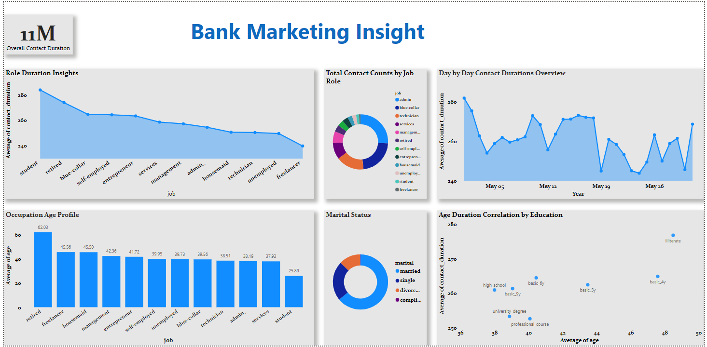

# Datacamp Data Engineering project 
## Cleaning Bank Marketing Campaign Data
This project involves cleaning bank marketing campaign data according to the provided instructions 
## Instructions

You have been asked to work with a bank to clean the data they collected as part of a recent marketing campaign, which aimed to get customers to take out a personal loan. They plan to conduct more marketing campaigns going forward so would like you to ensure it conforms to the specific structure and data types that they specify so that they can then use the cleaned data you provide to set up a PostgreSQL database, which will store this campaign's data and allow data from future campaigns to be easily imported.

They have supplied you with a csv file called `"bank_marketing.csv"`, which you will need to clean, reformat, and split the data, saving three final csv files. Specifically, the three files should have the names and contents as outlined below:

+ Clean bank_marketing.csv and store as three DataFrames called `client`, `campaign`, and `economics`, each containing the columns outlined in the notebook and formatted to the data types listed.

+ Save the three DataFrames to csv files, without an index, as `client.csv`, `campaign.csv`, and `economics.csv` respectively.
To view more instructions  and the whole project open the notebook below 
# [View Notebook](https://github.com/WAKIOM/Cleaning-Marketing-Campaign-Data/blob/main/Bank-Marketing-Data-Cleaning-Project/notebook.ipynb)

To view the files created click the link below
# [View files](https://github.com/WAKIOM/Cleaning-Marketing-Campaign-Data/tree/main/Bank-Marketing-Data-Cleaning-Project)

- **visualizations/**: Contains the Power BI file and a screenshot of the dashboard.

## Data Source
The dataset used for this analysis is the Bank Marketing Dataset, which includes information about various marketing campaigns run by a Portuguese banking institution. The data includes attributes such as job roles, age, marital status, education, and contact durations.

## Visualizations
The main visualization is the Bank Marketing Insight dashboard created using Power BI. The dashboard provides an interactive way to explore the data and gain insights.

## Insights
### Key Findings
1. **Role Duration Insights**: 
    - Students and retired individuals have the highest average contact durations.
    - Freelancers and technicians have the lowest average contact durations.

2. **Total Contact Counts by Job Role**: 
    - The pie chart shows the distribution of total contact counts across different job roles, with blue-collar and management roles having significant proportions.

3. **Day by Day Contact Durations Overview**: 
    - The line chart indicates fluctuations in average contact durations over the month of May.

4. **Occupation Age Profile**: 
    - Retired individuals have the highest average age, while students have the lowest.

5. **Marital Status**:
    - The marital status distribution shows a higher proportion of married individuals.

6. **Age Duration Correlation by Education**:
    - There is a notable correlation between education levels and average contact durations, with illiterate individuals having the highest average contact duration.

### Data-Driven Decisions
Based on the insights gained from the dashboard:
- **Targeted Marketing**: Marketing strategies can be tailored to focus on students and retired individuals who show higher engagement durations.
- **Resource Allocation**: Allocate resources efficiently by understanding the peaks and troughs in contact durations over time.
- **Segmentation**: Create targeted campaigns for different job roles and education levels to improve campaign effectiveness.

## Contribution

1. Open the visualization:
    - The `Visualization` folder contains the Power BI file (`Bank_Marketing_Insight.pbix`). Open this file in Power BI Desktop to interact with the dashboard.

## Contributions
This project was developed by [Afolabi Olawale](https://github.com/walethewave). Contributions include:
- Data analysis and preprocessing.
- Developing the Power BI dashboard to visualize key insights.
- Compiling the project documentation and readme file.

For any questions or feedback, feel free to reach out to [lekanolawale477@gmail.com](mailto:lekanolawale477@gmail.com).

---

